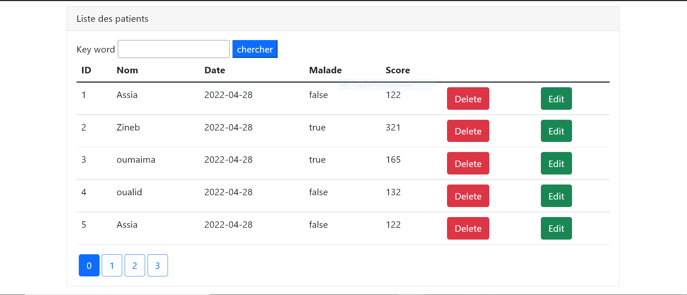
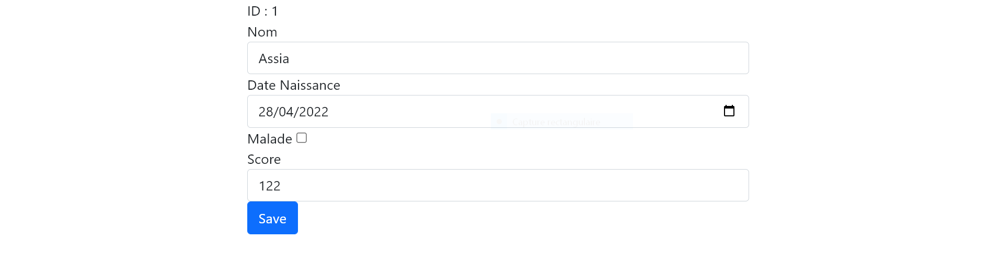
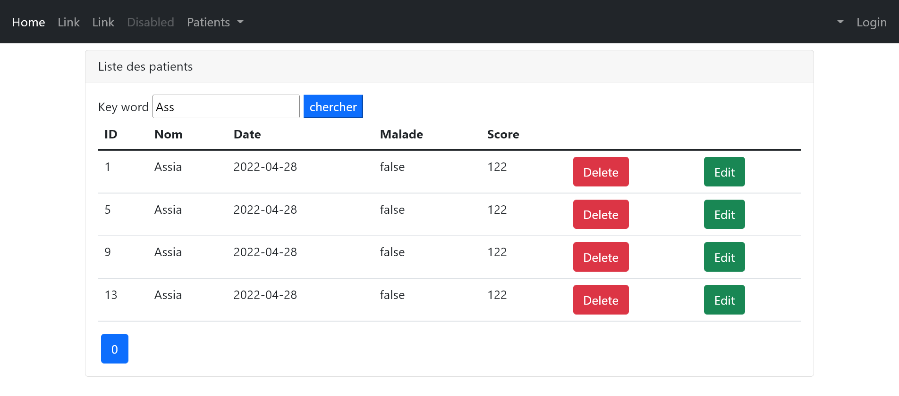
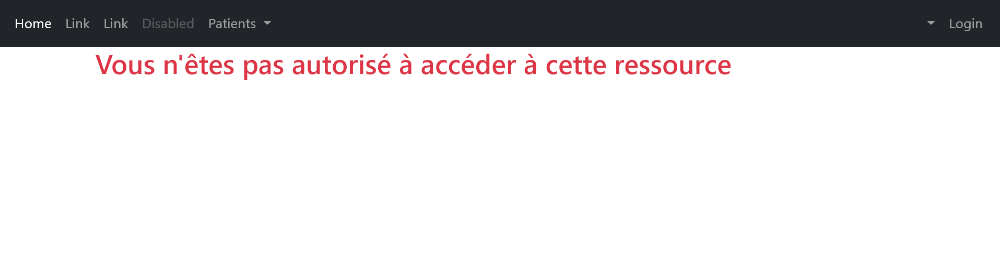

<h3>login pour acceder à l'application</h3>

<h3>acceder en tant qu'administrateur</h3>

<h3>supprimer un patient</h3>

<h3>editer les informations d'u patient</h3>

<h3>chercher un patient</h3>

<h3>editer ou supprimer un patient en tant que user</h3>
